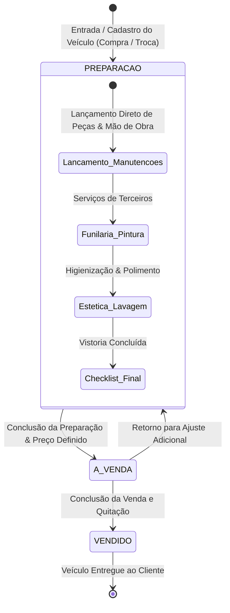
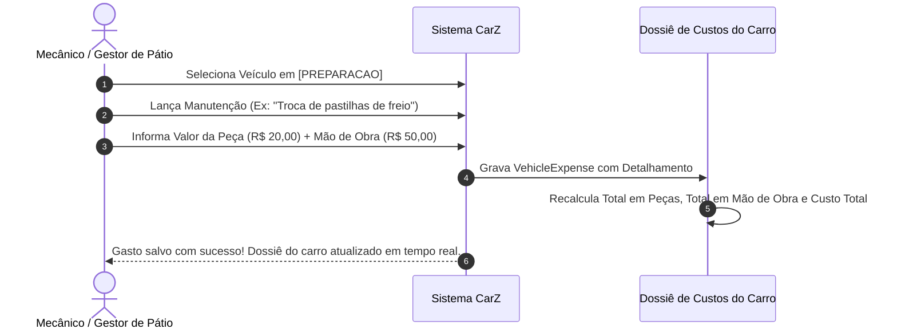
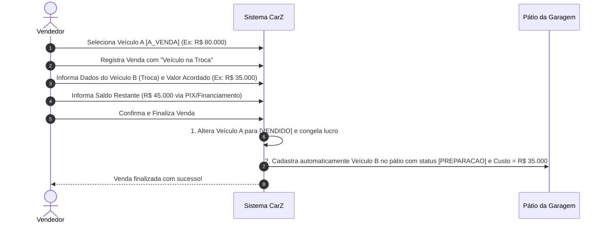

# CarZ - OpenSpec: 04. Fluxos Operacionais & Máquinas de Estado

## 1. Ciclo de Vida do Veículo em 3 Etapas

---

## 2. Fluxo de Lançamento de Peças e Serviços no Veículo

---

## 3. Fluxo de Venda com Veículo na Troca (Trade-in)

