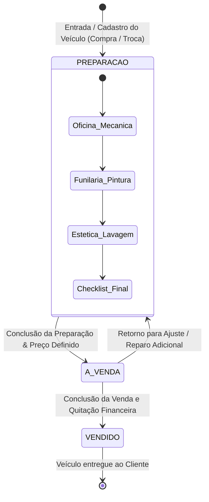
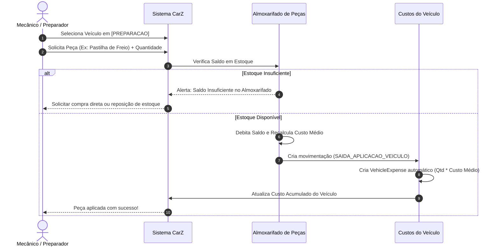
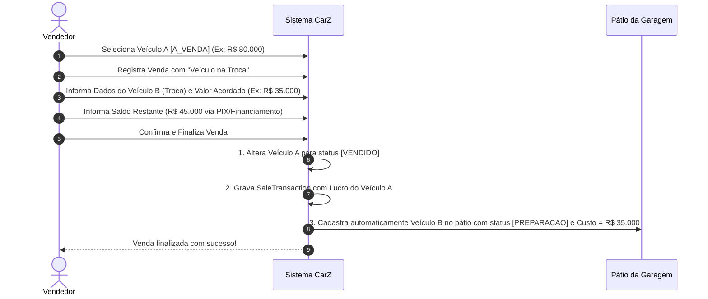

# CarZ - OpenSpec: 04. Fluxos Operacionais & Máquinas de Estado

## 1. Ciclo de Vida do Veículo em 3 Etapas

O ciclo de vida dos veículos na garagem é simplificado e direto, composto estritamente por **3 etapas**:

---

### Detalhamento das 3 Etapas:

| Etapa | Status | Ações Permitidas no Sistema |
| :--- | :--- | :--- |
| **1ª Etapa: Preparação** | `PREPARACAO` | • Entrada e registro do veículo na garagem. • Aplicação de peças do almoxarifado (debitando saldo). • Lançamento de despesas diretas (funilaria, mecânica, laudo, IPVA). • Registro do custo acumulado em tempo real. |
| **2ª Etapa: À Venda** | `A_VENDA` | • Veículo disponível no pátio físico e nos anúncios (Webmotors, etc.). • Ficha do veículo com custo base acumulado travado para consulta da equipe. • Vendedores realizam simulações de proposta e margem de lucro. |
| **3ª Etapa: Vendido** | `VENDIDO` | • Registro do cliente comprador e forma de pagamento. • Abatimento por veículo na troca (*Trade-in*, se houver). • Apuração e congelamento do **Lucro Bruto e Líquido Realizado**. • Baixa final no estoque de veículos da garagem. |

---

## 2. Fluxo de Aplicação de Peças em Veículo (Durante a Preparação)

---

## 3. Fluxo de Venda com Veículo na Troca (Trade-in)

